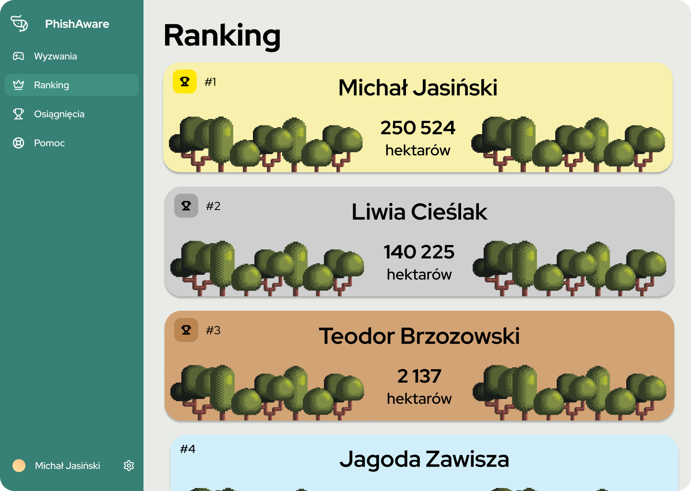
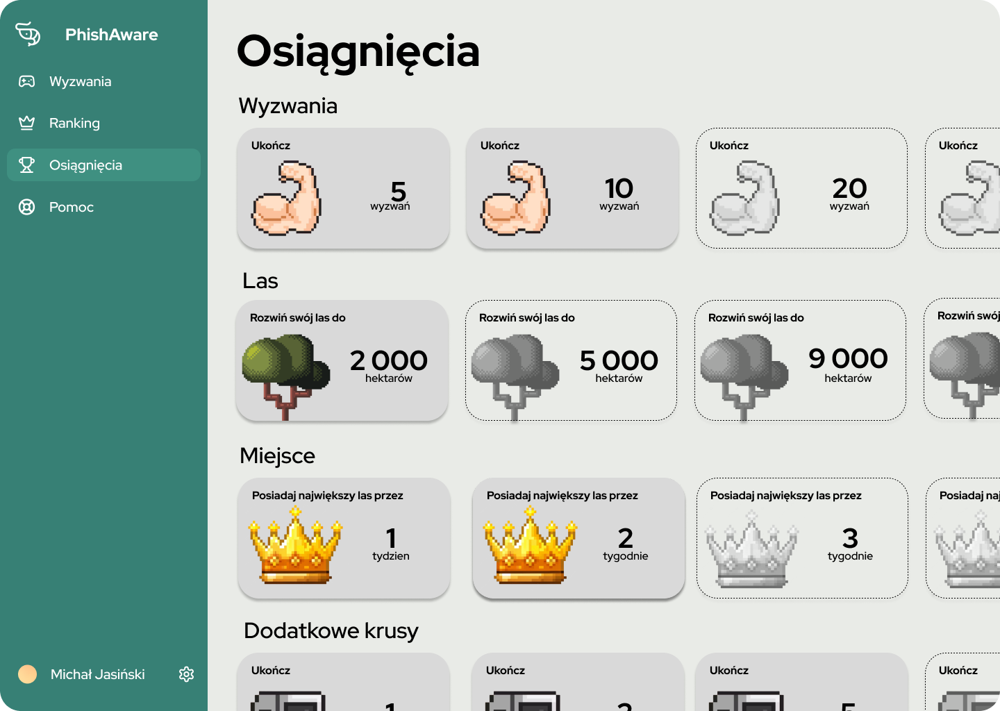
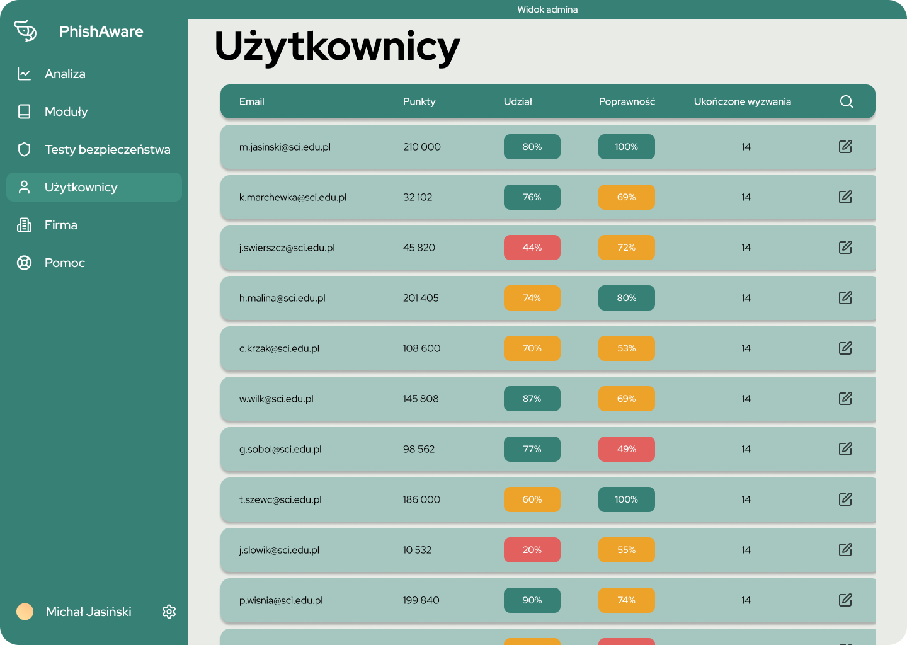
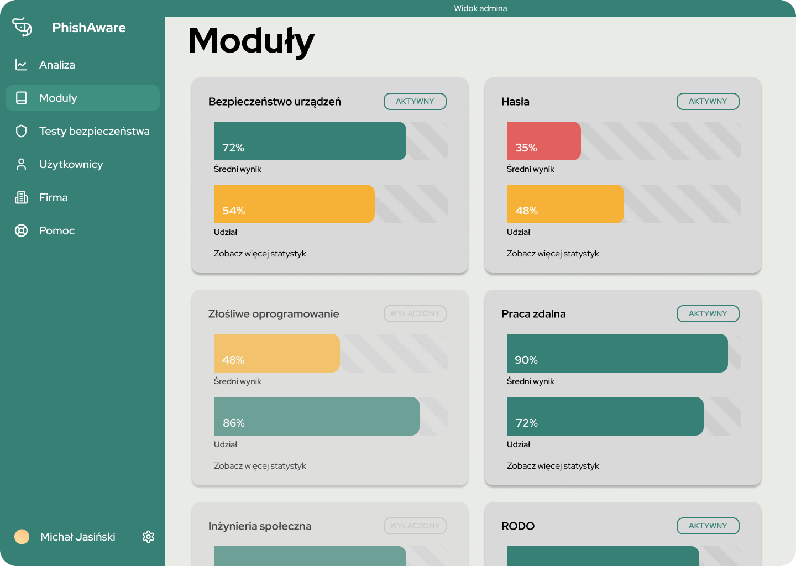

# PhishAware
**The "Duolingo of cybersecurity"**

**Live Version (Prototype):** [phishaware.vercel.app](https://phishaware.vercel.app)

PhishAware is a modern training system that not only teaches through gamification but also tests effectiveness in a real environment and adapts to the employee's needs. We transform the biggest threat (the human factor) into your company's strongest line of defense.

---

## Why PhishAware?

Up to 95% of breaches are caused primarily by human error. Traditional solutions fail - they are often boring courses with no results, too much theory, too little practice, and a lack of personalization.

In 2024 alone, $12,500,000,000 was lost due to cyber scammers, and 83% of companies fell victim to cybercrimes.

---

## Main Prototype Features

### 1. Learning Through Gamification
Short, weekly security lessons (3 - 5 minutes) that adapt to the employee's needs. This includes growing your own forest with each completed lesson and team rankings driving friendly competition.

### 2. Realistic Knowledge Testing
Realistic tests in a natural environment... exactly when no one expects it.

### 3. Administrator and Analyst Panel
Detailed analytics and an admin view for users, allowing you to track participation rates and test results.

---

## Educational Modules

A comprehensive approach to threats, including:
* Phishing, Vishing, Smishing, Pretexting, Baiting
* Passwords, Device security, Remote work, Workplace security
* GDPR (RODO), Privacy, Safe internet, Malware

## Polish 

# PhishAware
**"Duolingo cyberbezpieczeństwa"** **Wersja Live (Prototyp):** [phishaware.vercel.app](https://phishaware.vercel.app)

PhishAware to nowoczesny system szkoleniowy, który nie tylko uczy przez gamefikację, ale też testuje skuteczność w realnym środowisku i dostosowuje się do potrzeb pracownika. Przekształcamy największe zagrożenie (czynnik ludzki) w najsilniejszą linię obrony Twojej firmy.

---
## Dlaczego PhishAware?

Aż 95% naruszeń jest spowodowanych przede wszystkim błędem ludzkim. Tradycyjne rozwiązania zawodzą - to często nudne kursy bez efektów, za dużo teorii, za mało praktyki i brak personalizacji. 

W samym 2024 roku stracono 12 500 000 000 USD z powodu cyberoszustów, a 83% firm padło ofiarą cyberprzestępstw.

---
## Główne funkcje prototypu
### 1. Nauka przez Grywalizację
Krótkie, cotygodniowe lekcje bezpieczeństwa (3 - 5 minut), które dostosowują się do potrzeb pracownika. Rozrastanie swojego lasu z każdą ukończoną lekcją oraz rankingi zespołowe napędzające przyjazną konkurencję.

### 2. Realistyczne testowanie wiedzy
Realistyczne testy w naturalnym środowisku... wtedy, kiedy nikt się nie spodziewa.

### 3. Panel Administratora i Analityka
Szczegółowa analityka i widok admina dla użytkowników, pozwalająca sprawdzić wskaźnik uczestnictwa i wyniki testów.

---
## Moduły Edukacyjne

Kompleksowe podejście do zagrożeń, obejmujące między innymi:
* Phishing, Vishing, Smishing, Pretexting, Baiting
* Hasła, Bezpieczeństwo urządzeń, Praca zdalna, Bezpieczeństwo w miejscu pracy 
* RODO, Prywatność, Bezpieczny internet, Malware

